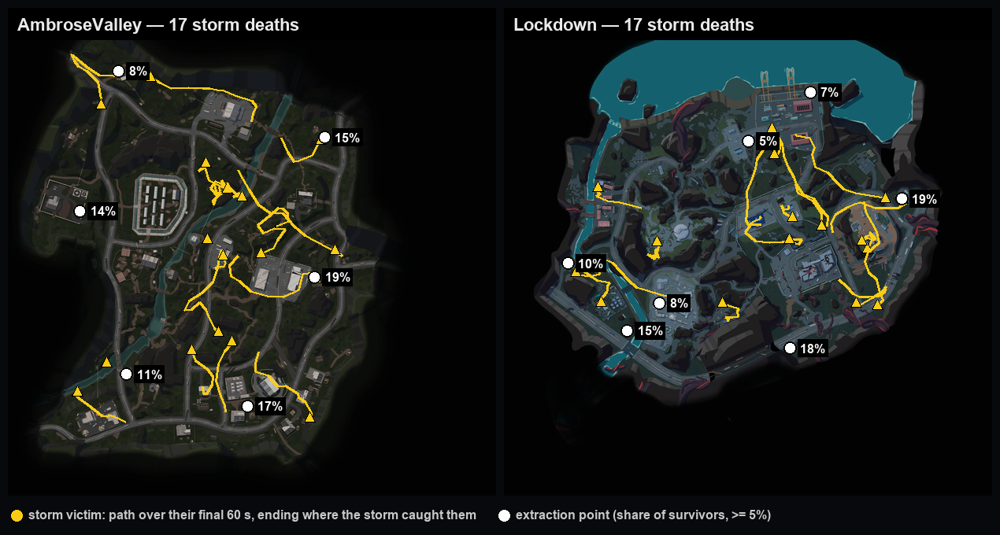
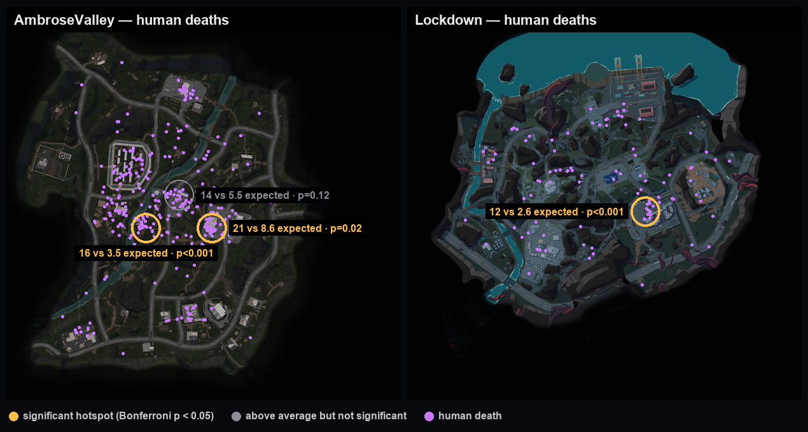

# Three things the data says about LILA BLACK

Based on 5 days of telemetry (Feb 10–14, 2026): 88,894 events, 796 matches, 781 runs by human
players. Every number here can be seen in the tool and regenerated with one command:

```bash
python3 analysis/insights.py --src /path/to/player_data
```

That script also runs the checks that decided what *not* to claim (end of this page).

**How I count.** A *human* is a UUID `user_id`. A *death* is a `Killed`, `BotKilled` or
`KilledByStorm` event in a human's file. Bot files also contain `BotKilled`, but there it means the
bot itself died, so those are left out. In the tool, turn **Bots** off to match these numbers.

---

## 1. Every match is one player against bots. There is no PvP at all.

**What caught my eye.** Clicking through matches, the Journeys counter always read "1H". Then the
six `Kill`/`Killed` events — the only human-vs-human combat events — turned out to be something else.

**The evidence**

| | |
|---|---|
| Matches with exactly one player | **795 of 796** — 779 by UUID, plus 16 where the only player-like actor has a numeric ID (see note) |
| The one match with two players | They moved together (at one point 1 unit apart) and both died to bots at the same spot, 69 s apart — a party playing co-op, not opponents |
| `Kill` / `Killed` events | 3 of each — and **each pair is one player logging both, at the same second and the same spot**, as their last event, alone in their match. These are self-inflicted deaths |
| Kills of one human by another | **0** |
| Human kills of bots (`BotKill`) | 2,232 |
| How human runs end | 51.2% killed by a bot · 5.0% by the storm · 0.4% self · 43.4% survive |

**Could this be a logging artefact** — one lobby of several players split across several `match_id`s?
The data says no. If lobbies were being split, matches on the same map would start at nearly the same
second far more often than chance. They don't: 5 pairs start within 5 s of each other, against ~7
expected from random arrivals (95% range 2–13). And players *were* available: Ambrose Valley had up
to **6 separate matches running at once**, and 13.7 hours in which at least two ran simultaneously.

*Note:* numeric IDs 1379, 1402 and 1429 behave exactly like players (`Position` and `Loot`, never
`BotPosition`) and appear once each in the 16 "no-human" matches. They are likely internal or test
accounts. I kept the README's rule (numeric = bot) but they should be confirmed.

**Is it actionable?** Yes.
- *Metrics affected:* players per match (1.00 today), PvP encounters per run (0), time to first
  encounter, extraction rate (43.4%).
- *Actions:*
  1. **Confirm whether solo is intended.** If it isn't, it's a matchmaking problem, not a population
     one: on Ambrose Valley there were often 2–6 people playing the same map at the same time, in
     separate matches.
  2. **If solo is the design,** retune contested spaces for PvE: multi-entrance chokepoints,
     long sightlines and loot contention exist for opponents who aren't there. Bot placement and bot
     density are the real difficulty controls.
  3. **Tag or exclude IDs 1379 / 1402 / 1429** so test traffic doesn't skew player stats.

**Why a level designer should care.** Maps are being tuned for a PvP threat that never appears.
Time spent balancing player-vs-player sightlines is currently wasted, and the bot encounter layout —
what players actually experience every run — is the part that matters.

---

## 2. Staying late is equally common on every map — but on Lockdown it's three times as deadly

**What caught my eye.** Storm deaths looked rare overall (39 in five days), but Lockdown's storm
heatmap was busy for a map with a third of Ambrose's matches.

**The evidence**

The storm works like a deadline: all 39 storm deaths happen **between 10:59 and 14:50 into the run**
(median 12:19).

| | Ambrose Valley | Lockdown | Grand Rift |
|---|---|---|---|
| Runs killed by the storm | 3.1% (17/554) | **10.0%** (17/170) | 8.8% (5/57) |
| Runs still going at 10:50 | 17% | 21% | 16% |
| … of which the storm killed | 18% | **49%** | 56% |
| Significance vs Ambrose | — | p = 0.001 | p = 0.02 (only 9 late runs) |

Players stay late at about the same rate everywhere — so it isn't that Lockdown players are greedier.
The difference is what happens to them once they're late.

They weren't standing around, either. **37 of 38 storm victims were moving in their last minute**
(median 129–161 units, versus 185–215 for players who got out), and they had looted almost as much as
survivors (median 18 items vs 22). These are players who played the run properly, headed for an exit,
and didn't make it.


*Yellow lines: each storm victim's path over their final 60 seconds. White dots: extraction points,
inferred from where surviving runs end (81–94% of survivors finish at one of these clusters).*

**Is it actionable?** Yes.
- *Metrics affected:* storm death rate (Lockdown 10.0% vs 3.1%), survival of players still in at
  10:50 (Lockdown 51% vs 72% on Ambrose), extraction rate, loot kept per run.
- *Actions:*
  1. **Time the escape routes on Lockdown in the editor:** from where players are at ~11 minutes to
     the nearest extraction, against the storm's speed. The yellow paths show the routes victims took.
  2. **Then choose a fix:** add an extraction point or shortcut where routes are longest, give
     Lockdown a later storm or a clearer warning, or both. The target: bring storm deaths among late
     players from 49% down toward Ambrose's 18%.
  3. **Check the inferred extraction points** against the real level config.
  4. **Watch Grand Rift** — same pattern, but only 9 late runs so far, so it isn't proven yet.

**Why a level designer should care.** The same player behaviour gets three times worse results on
Lockdown, which points at the map — its routes or its storm timing — not the players. And storm
deaths are the most expensive kind: a full 12-minute run and a full bag, lost at the end.

---

## 3. Two specific fights kill players at 4.5× the normal rate, and dying costs over half the run

**What caught my eye.** The Death zones heatmap isn't spread out like traffic — it has a few hard
bright spots. The question was whether those are just busy places or genuinely dangerous ones.

**The evidence**

To separate "busy" from "dangerous", I compared deaths in each area with how much time players spend
there. On a 24×24 grid, only areas with enough traffic were tested, and the result was corrected for
testing many areas at once (Bonferroni), so a random bright spot can't pass.

| Map | Where (world x, z) | Deaths | Expected from traffic | Corrected p | Kills per death there (map average) |
|---|---|---|---|---|---|
| Ambrose Valley | (−51, −79), river crossing south of the walled compound | **16** | 3.5 | < 0.001 | 2.6 (5.3) |
| Lockdown | (104, −21), west side of the central walled facility | **12** | 2.6 | < 0.001 | 2.8 (3.9) |
| Ambrose Valley | (99, −79), west edge of the twin-warehouse compound | **21** | 8.6 | 0.02 | 3.4 (5.3) |

In all three, players still win more fights than they lose — but well below the map average. These
are **overtuned fights**, not unfair traps.



Why it matters: dying costs a lot.

| | Survived (339 runs) | Died (442 runs) |
|---|---|---|
| Median run length | 8:32 | 4:46 |
| Median items looted | **22** | **9** |
| Median bot kills | 3 | 1 |

Loot is collected evenly through a run (27% / 29% / 27% / 18% by quarter), so an early death throws
away a proportional share of progress.

**Is it actionable?** Yes — this is the easiest one to act on.
- *Metrics affected:* overall death rate (56.6%), deaths and kills-per-death at these three spots,
  extraction rate, median loot per run.
- *Actions:*
  1. **Review these three spots first** — bot count, spawn placement, cover and sightlines. Use the
     world coordinates above, or hover the markers in the tool's Death zones view.
  2. **Aim to bring kills-per-death there closer to the map average**, not to zero — they should still
     be fights.
  3. **Re-check after changing them:** re-run the script, or open Death zones with Bots off.

**Why a level designer should care.** It turns "this area feels harsh" into a short, ranked list with
coordinates and a measure of how much harsher it is — and it shows that deaths there cost players more
than half of what a successful run earns.

---

## Tested and not claimed

These looked like insights at first and didn't hold up. Listed so the three above can be trusted.

- **"Grand Rift wastes half its map."** Its dead space looks largest, but it has 57 matches to
  Ambrose's 553 — fewer runs means less of any map gets visited. Compared at 57 matches each, Grand
  Rift is actually explored *most* widely per match (1,780 grid cells vs 1,614). My first version also
  counted the black void and Lockdown's sea as "unvisited"; the tool now reads land from the minimap.
- **"Lockdown players die to the storm because exits are further away."** Whether that's true depends
  on whether a few small end-of-run clusters on Ambrose count as extraction points. With them, Ambrose
  looks much closer to an exit; without them, the two maps are the same. Too fragile to claim.
- **"Lockdown's storm problem is in the east."** Most storm deaths are in the east, but that's where
  most late players are; the death rate there isn't higher than in the west.
- **"A trap at Ambrose (−126, −79)."** 6 deaths against only 4 kills looked like a trap, but it fails
  the correction (p = 0.18). Worth a look, not a finding.
- **"Players are leaving."** Daily players drop from 98 to 12, but Feb 14 is a partial day, and five
  days can't tell churn apart from a playtest group winding down.
