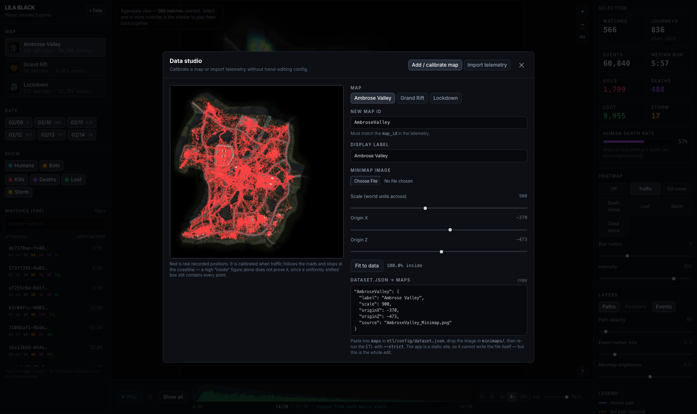
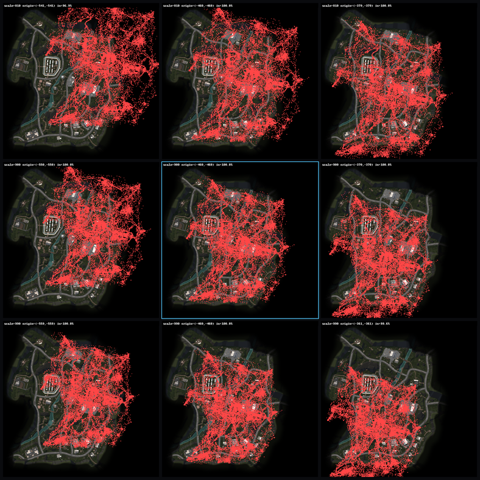

# LILA BLACK — Player Journey Explorer

A browser tool that turns raw LILA BLACK telemetry into something a Level Designer can
actually read: player paths drawn on the real minimaps, kill/death/loot/traffic heatmaps,
dead-space detection, and per-match playback.

**Live:** https://lila-black-journeys.vercel.app — no login, no setup
(fallback mirror: https://jabberwock555.github.io/lila-player-journey/)

| Deliverable | Where |
|---|---|
| Working tool | the live link above |
| Source code | this repo — `src/` (app), `etl/` (data pipeline), `analysis/` (insight numbers) |
| Tech stack, setup, env vars | this README |
| Architecture (one page) | [ARCHITECTURE.md](ARCHITECTURE.md) |
| Three insights, with evidence | [INSIGHTS.md](INSIGHTS.md) — every figure regenerates with `python3 analysis/insights.py` |
| Deeper engineering notes | [docs/ENGINEERING_NOTES.md](docs/ENGINEERING_NOTES.md) |


*Aggregate view — traffic density across 566 matches, with kill/death/loot markers overlaid.*


*Single match — one 11:14 run with 17 kills and 53 loot pickups, ready to play back.*

---

## What it does

| Capability | Where |
|---|---|
| Player journeys on the correct minimap, world coords properly projected | main canvas |
| Humans vs bots told apart by **colour and line style** (cyan solid / amber dashed) | main canvas + legend |
| Kills, deaths, loot and storm deaths as **distinct shapes**, not just colours | ★ ✕ ◆ ▲ |
| Filter by map, date and match | left sidebar |
| Timeline scrubbing + playback at 1–16× with an adjustable trail | bottom bar |
| **Multi-match playback** — select several runs and play them from their own starts | match list |
| Match list filters: outcome, storm, min kills/loot/length, sort | sidebar → filters |
| **Positions layer** — every sampled player location as a human/bot dot | right panel → Layers |
| In-app map calibration and telemetry import | sidebar → + Data |
| Heatmaps: traffic, kill zones, death zones, loot | right panel |
| **Dead space** overlay — walkable land nobody entered (land read from the minimap; interior and coast reported separately) | right panel |
| Hover any event for actor / match / time / world coords | main canvas |
| Live world-coordinate readout for cross-checking against the editor | bottom-left |

Keyboard: `Space` play/pause · `1`–`9` heatmap mode · `P`/`O`/`M` toggle paths/positions/events ·
`F` fit view.

---

## Tech stack

| Layer | Choice | Why |
|---|---|---|
| ETL | Python 3 · pyarrow · pandas · Pillow | One offline pass over the parquet files; pyarrow reads them natively despite the missing extension |
| Config | One `dataset.json` read by both ETL and app | Maps, event types and layers are declared once; adding any of them needs no code change |
| Data format | Packed binary (struct-of-arrays) + one JSON manifest | ~21 bytes/event vs ~120 as JSON; drops straight into TypedArrays with zero parsing |
| Frontend | React 18 + TypeScript + Vite | Fast builds, typed data contracts, no runtime framework weight |
| Rendering | Canvas 2D | 89k events and 800+ polylines render in a few ms; no WebGL dependency or shader maintenance |
| Styling | Tailwind CSS | Dense, consistent dark UI without a component library |
| Analysis | Python — `analysis/insights.py` | Reproduces every number and figure in INSIGHTS.md, including the significance checks |
| Hosting | Vercel (static) | No server needed — see ARCHITECTURE.md |

There is **no backend and no database**. The whole dataset compresses to ~2.6 MB of static
assets, so the browser loads it once and every filter, aggregation and heatmap is computed
client-side. See [ARCHITECTURE.md](ARCHITECTURE.md) for the reasoning and trade-offs.

---

## Setup

### Run the app

```bash
npm install
npm run dev          # http://localhost:5173
```

The repo already contains the processed data (`public/data`, `public/maps`), so the app runs
without the raw dataset.

### Regenerate the data (optional)

Only needed if the source telemetry changes.

```bash
pip install pyarrow pandas pillow
python3 etl/build_data.py --src /path/to/player_data
```

`--src` must point at the folder holding the day folders (`February_10/`, … — any
`<Month>_<DD>` name works) and `minimaps/`.
It writes `public/data/manifest.json`, `public/data/<Map>.bin` and `public/maps/<Map>.webp`,
printing validation counts as it goes (timestamp alignment, out-of-bounds coordinates,
duplicate rows).

### Reproduce the insights

```bash
python3 analysis/insights.py --src /path/to/player_data
```

Prints every statistic quoted in INSIGHTS.md — including the checks behind the claims that
were *dropped* — and regenerates `docs/insight-*.png`. Takes about 10 seconds.

### Build

```bash
npm run build        # -> dist/
npm run preview
```

### Deploy

```bash
npx vercel --prod
```

`vercel.json` pins the build (`npm run build` → `dist/`) and sets caching: immutable for
Vite's content-hashed `/assets`, and revalidate-on-every-load for `/data` and `/maps`. Those
sit at stable paths, so a longer cache once paired an old data file with new code and broke
the site; with ETags a repeat load costs a handful of empty `304` responses.

A GitHub Pages deploy is kept as a working fallback:

```bash
./deploy.sh          # builds and publishes dist/ to the gh-pages branch
```

The app is a plain static bundle, so `dist/` can be dropped on any static host.
`vite.config.ts` reads `BASE_PATH` for hosts that serve from a subpath (Pages needs
`/lila-player-journey/`); it defaults to `/` and needs no setting on a domain root.

### Environment variables

**None.** The app is fully static and reads only its own bundled assets.

---

## Extending the dataset

Everything the ETL and the app know about maps, event types and layers lives in
**`etl/config/dataset.json`**. Neither the Python nor the TypeScript hardcodes any of it,
so the two cases below are config edits, not code changes.

### Adding more data

Drop the new day folders alongside the existing ones and re-run the ETL:

```bash
python3 etl/build_data.py --src /path/to/player_data --strict
```

Any `<MonthName>_<DD>` folder is picked up — `March_03`, `December_01`, whatever comes
next. The year is read from the timestamps rather than assumed, so a drop from a later
year works unchanged. Folders that aren't day folders are reported and skipped rather
than silently ignored.

`--strict` exits non-zero if a map's events fall outside its minimap, a configured map
has no data, a minimap is missing, or more than 5% of rows carry a timestamp that
disagrees with the folder they came from. Full detail lands in
`public/data/build-report.json`.

### In the app: the data studio



The **+ Data** button opens a studio with the two jobs that used to mean editing JSON by
hand:

- **Add / calibrate map** — pick or upload a minimap, drag `scale` / `originX` / `originZ`
  with the real recorded positions drawn live on top, hit **Fit to data** for a starting
  point, and copy out the finished `dataset.json` block.
- **Import telemetry** — drop `.nakama-0` files to parse them in the browser and check them
  against the current config: event counts, unknown event types, unconfigured maps,
  timestamp range and out-of-bounds percentage, using the same rules as the ETL.

The deployed app is a static bundle with no backend, so it cannot write into the repo — the
studio gets you the exact config text and tells you the data is valid, and the two steps
below commit it.

### Adding a map

1. Put the minimap image in `<src>/minimaps/`.
2. Find its world footprint:

   ```bash
   python3 etl/calibrate_map.py --map NewMap --src /path/to/player_data
   ```

   This prints the map's world extents, proposes two candidate `scale`/`origin` pairs,
   and writes `calibration_NewMap.png` — a 3×3 contact sheet of the proposal and nearby
   variants with every event overlaid. Pick the tile where traffic follows the roads and
   stays inside the landmass.

   
   *Ambrose Valley: the proposal is centre (cyan border), scale varying down the rows and
   origin across the columns. Tiles where the data spills past the coastline or leaves a
   margin the map does not have are wrong; the `in=` figure counts points landing inside
   the image, which catches gross errors but not a uniform offset — hence the eyeball.*

   (`--verify-known` re-derives the three shipped maps as a self-test; it lands within
   ~10%, which is why the visual check is the real answer and not the number.)
3. Paste the printed block into `maps` in `dataset.json`, adjusting to the tile you chose.
4. Re-run the ETL with `--strict`.

The map picker, filters and heatmaps are all driven by the manifest, so the new map
appears in the UI with no frontend change.

### Adding an event type

Append it to `events` in `dataset.json` and give its `layer` an entry in `layers`
(label, badge, colour, marker shape, heatmap ramp). The UI grows a filter toggle, a stat
tile, a heatmap mode, a timeline series and a legend row automatically.

**Append only — never reorder or remove.** An event's position in that list *is* its
wire format: the `.bin` files store it as a `uint8`. The ETL refuses to build if the list
stops being a superset of the previously built manifest.

---

## Project layout

```
etl/build_data.py        parquet -> binary + manifest + downscaled minimaps
etl/calibrate_map.py     propose scale/origin for a new map + contact sheet
etl/config/dataset.json  maps, event types, layers — the single source of truth
analysis/insights.py     reproduces every number and figure in INSIGHTS.md
public/data/             manifest.json, build-report.json, <Map>.bin
public/maps/             minimaps downscaled to 2048px webp
src/lib/
  types.ts               data contracts shared with the ETL
  data.ts                fetch + TypedArray decode
  select.ts              filters -> index sets + summary stats
  heatmap.ts             density grids, blur, colour ramps, dead-space detection
  render.ts              canvas renderer + world<->screen projection
  importer.ts            in-browser parquet import (same rules as the ETL)
src/components/          MapView, Sidebar, Inspector, Timeline, Studio, Onboarding
docs/                    screenshots, insight figures, ENGINEERING_NOTES.md
vercel.json              build + cache headers for the Vercel deploy
deploy.sh                build + publish to gh-pages (fallback host)
ARCHITECTURE.md          design decisions, coordinate mapping, trade-offs
INSIGHTS.md              three findings from the data, with evidence
```

---

## Walkthrough

1. **Land on Ambrose Valley** (the busiest map, ~70% of the data) with the traffic heatmap on.
   Hot cores are the POIs; the faint cyan web between them is the route network.
2. **Narrow the scope.** Click a date chip, or open **filters** to narrow by outcome
   (died / survived), storm deaths, minimum kills, loot or length, and re-sort the list.
3. **Pick runs to watch.** Click a match to isolate it; ⌘/Ctrl-click to add more, or
   **select all listed** to take everything the filters left. With several selected, each
   match is rebased onto its own start so they play together rather than being strung out
   across hours of wall clock.
4. **Play it back.** `Space` or the Play button. The trail slider controls how much history
   stays drawn — short trail to watch movement, `full` to see the completed route.
5. **Switch heatmap modes** (`1`–`9`) to compare where players travel, where they kill,
   where they die, and where they loot.
6. **Turn on Dead space** to see walkable land nobody entered, reported as an interior figure
   and one including the coastal rim. Compare maps only at similar numbers of matches — see
   the end of INSIGHTS.md for why.
7. **Toggle Positions** (`O`) to swap the path lines for a dot at every sampled location,
   coloured by human/bot — the view for "where was everyone", without the connecting lines.
8. **Hover any marker or dot** for the exact actor, match, timestamp and world coordinates,
   and read the live `x / z` under the cursor to line the map up with the editor.
9. **Check an insight yourself.** Turn **Bots** off (so only human deaths count), pick
   Lockdown, choose **Death zones**, and hover the bright spot west of the central walled
   facility — the 12-death hotspot from INSIGHTS.md.
10. **Add data or a map** with **+ Data** — see *Extending the dataset* above.

Docs: [ARCHITECTURE.md](ARCHITECTURE.md) · [INSIGHTS.md](INSIGHTS.md) ·
[docs/ENGINEERING_NOTES.md](docs/ENGINEERING_NOTES.md)
