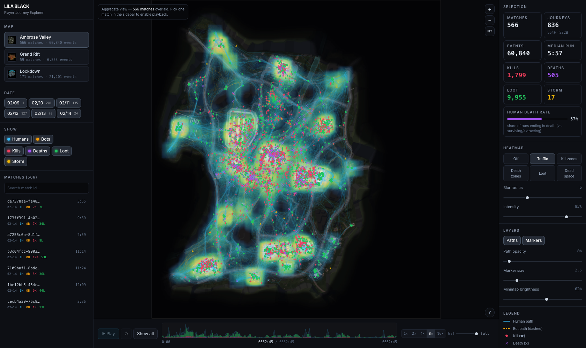
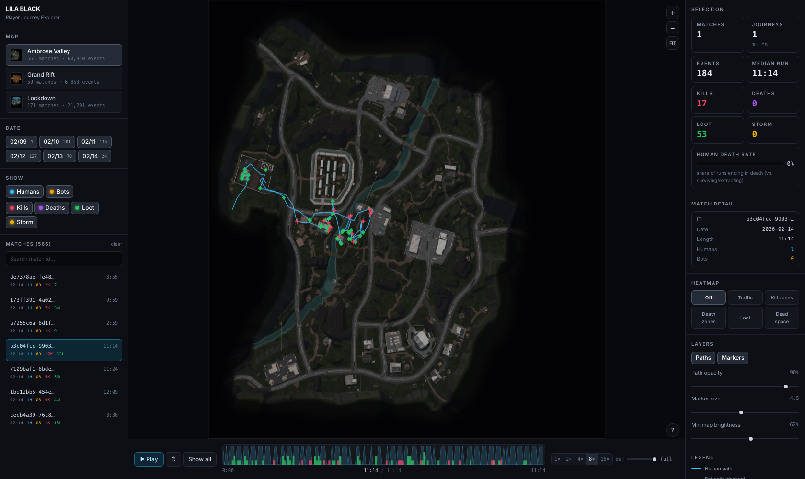

# LILA BLACK — Player Journey Explorer

A browser tool that turns raw LILA BLACK telemetry into something a Level Designer can
actually read: player paths drawn on the real minimaps, kill/death/loot/traffic heatmaps,
dead-space detection, and per-match playback.

**Live:** https://lila-player-journey.vercel.app


*Aggregate view — traffic density across 566 matches, with kill/death/loot markers overlaid.*


*Single match — one 11:14 run with 17 kills and 53 loot pickups, ready to play back.*

---

## What it does

| Capability | Where |
|---|---|
| Player journeys on the correct minimap, world coords properly projected | main canvas |
| Humans vs bots told apart by **colour and line style** (cyan solid / amber dashed) | main canvas + legend |
| Kills, deaths, loot and storm deaths as **distinct shapes**, not just colours | ★ ✕ ◆ ▲ |
| Filter by map, date and match | left sidebar |
| Timeline scrubbing + playback at 1–16× with an adjustable trail | bottom bar |
| Heatmaps: traffic, kill zones, death zones, loot | right panel |
| **Dead space** overlay — playable areas with zero traffic | right panel |
| Hover any event for actor / match / time / world coords | main canvas |
| Live world-coordinate readout for cross-checking against the editor | bottom-left |

Keyboard: `Space` play/pause · `1`–`6` heatmap mode · `P`/`M` toggle paths/markers · `F` fit view.

---

## Tech stack

| Layer | Choice | Why |
|---|---|---|
| ETL | Python 3 · pyarrow · pandas · Pillow | One offline pass over the parquet files; pyarrow reads them natively despite the missing extension |
| Data format | Packed binary (struct-of-arrays) + one JSON manifest | ~21 bytes/event vs ~120 as JSON; drops straight into TypedArrays with zero parsing |
| Frontend | React 18 + TypeScript + Vite | Fast builds, typed data contracts, no runtime framework weight |
| Rendering | Canvas 2D | 89k events and 800+ polylines render in a few ms; no WebGL dependency or shader maintenance |
| Styling | Tailwind CSS | Dense, consistent dark UI without a component library |
| Hosting | Vercel (static) | No server needed — see ARCHITECTURE.md |

There is **no backend and no database**. The whole dataset compresses to ~2.6 MB of static
assets, so the browser loads it once and every filter, aggregation and heatmap is computed
client-side. See [ARCHITECTURE.md](ARCHITECTURE.md) for the reasoning and trade-offs.

---

## Setup

### Run the app

```bash
npm install
npm run dev          # http://localhost:5173
```

The repo already contains the processed data (`public/data`, `public/maps`), so the app runs
without the raw dataset.

### Regenerate the data (optional)

Only needed if the source telemetry changes.

```bash
pip install pyarrow pandas pillow
python3 etl/build_data.py --src /path/to/player_data
```

`--src` must point at the folder holding `February_10/ … February_14/` and `minimaps/`.
It writes `public/data/manifest.json`, `public/data/<Map>.bin` and `public/maps/<Map>.webp`,
printing validation counts as it goes (timestamp alignment, out-of-bounds coordinates,
duplicate rows).

### Build

```bash
npm run build        # -> dist/
npm run preview
```

### Environment variables

**None.** The app is fully static and reads only its own bundled assets.

---

## Project layout

```
etl/build_data.py        parquet -> binary + manifest + downscaled minimaps
public/data/             manifest.json, AmbroseValley.bin, GrandRift.bin, Lockdown.bin
public/maps/             minimaps downscaled to 2048px webp
src/lib/
  types.ts               data contracts shared with the ETL
  data.ts                fetch + TypedArray decode
  select.ts              filters -> index sets + summary stats
  heatmap.ts             density grids, blur, colour ramps, dead-space detection
  render.ts              canvas renderer + world<->screen projection
src/components/          MapView, Sidebar, Inspector, Timeline, Onboarding
ARCHITECTURE.md          design decisions, coordinate mapping, trade-offs
INSIGHTS.md              three findings from the data, with evidence
```

---

## Walkthrough

1. **Land on Ambrose Valley** (the busiest map, ~70% of the data) with the traffic heatmap on.
   Hot cores are the POIs; the faint cyan web between them is the route network.
2. **Narrow the scope.** Click a date chip, or search a match id. Selecting a single match
   switches the view to a bright single-path preset and enables playback.
3. **Play it back.** `Space` or the Play button. The trail slider controls how much history
   stays drawn — short trail to watch movement, `full` to see the completed route.
4. **Switch heatmap modes** (`1`–`6`) to compare where players travel, where they kill,
   where they die, and where they loot.
5. **Turn on Dead space** to see playable geometry that nobody touches, with a percentage
   readout of unvisited area for the current filter.
6. **Hover any marker** for the exact actor, match, timestamp and world coordinates, and read
   the live `x / z` under the cursor to line the map up with the editor.

Docs: [ARCHITECTURE.md](ARCHITECTURE.md) · [INSIGHTS.md](INSIGHTS.md)
